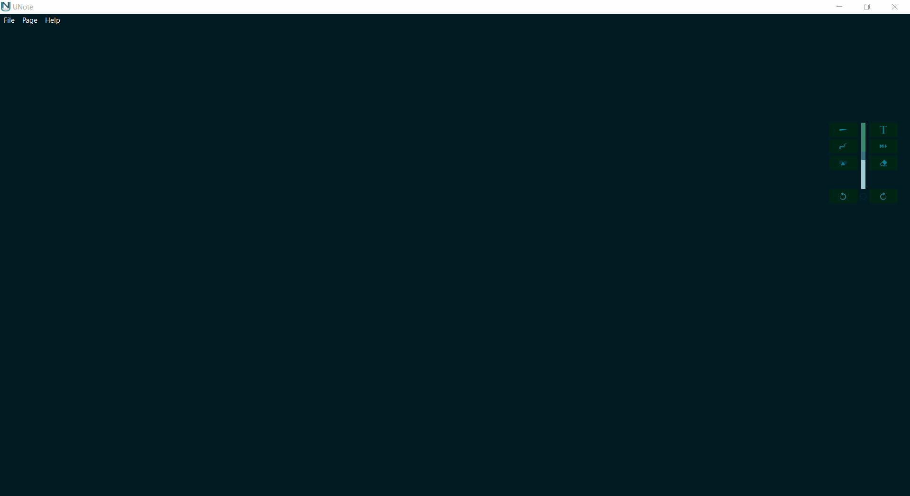

#  [UNote](https://stroblme.de/unote/)

Fills the lack of an open-source PDF Editor with the capability to draw and add notes not only to the PDF pages but, in future, to a virtually unlimited space.

The executable can be downloaded [here](https://stroblme.de/unote/) or directly from this Github Repository.

## Features

Here a quick demonstration of only a few features:



A more detailed (and constantly extended) list of features:

- PDF Annotating/ Editing
    - Text Boxes (with and without pointers)
    - Highlighting
    - Freehand drawing (Mouse *and* Pen Support) with *line smoothing*
    - Different colors available for all marker tools
    - Forms (only lines by now)
    - Erasing
    - Insert Images
- PDF Tools
    - Insert/ Delete Pages
    - Create PDFs
- Additional Features
    - Active Pen Support
    - Automatic Form Detection From Freehand Annotations
    - Various Options For Annotation Tools
    - Dark/ Light Mode
    - Fast PDF Loading
    - Split View

See [CHANGELOG.md](https://github.com/stroblme/unote/blob/master/CHANGELOG.md) for a complete list of latest features in the current release

*Right now I'm focussing on the Pen Support. Features like Text Boxes are currently not maintained*

## Shortcuts

- Ctrl-T: Add Text Box
- Ctrl-D: Freehand Draw
- Ctrl-M: Mark/ Highlight Mode
- Ctrl-E: Eraser
- Ctrl-S: Save
- Ctrl-P: Open Preferences
- Ctrl-Q: Quit application
- Esc: Cancel
- Ctrl-Return: Confirm

## Main Requirements

- Python3.6
- PySide2
- PyMuPDF

# Getting started

1. Set up a python venv

Create a venv

```
py -m venv venv
```

Activate it

```
./venv/Scripts/activate
```

2. Install the dependencies

Use pip to do so

```
pip install -r requirements.txt
```

3. Run

Open vscode and run one of the predefined launch tasks.

```
code .
```


## Building

Uses [fbs](https://github.com/mherrmann/fbs-tutorial) which relies on pyinstaller.
